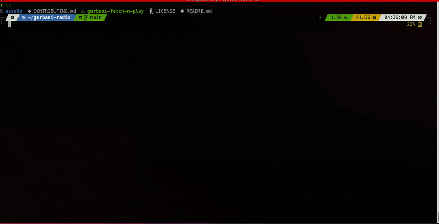

# Gurbani Radio Fetch-n-Play


**Gurbani Radio Fetch-n-Play** is a bash script that fetches live Gurbani channels from Sikhnet.com and allows you to play them using VLC. It also provides options to check the online status of channels and stop any ongoing playback.

This project combines the gists I have written together with `fzf`
- [get-live-gurbani-channels.sh](https://gist.github.com/savitojs/ca6fd566d7bd890ce8568311c284a79d)
- [GoldenTempleLive.sh](https://gist.github.com/savitojs/699d2840d3d5115893c05246074f43b5)

## Features

- Fetch and display live Gurbani channels from Sikhnet.com
- Play selected channels using VLC
- Check the online status of available channels
- Stop VLC playback directly from the command line
- Switch channels between online via CLI

## Prerequisites

The script requires the following tools to be installed:

- `vlc`
- `fzf`
- `jq`

The script will automatically check for these dependencies and attempt to install them if they are missing.

## Supported Platforms

- **macOS** (via Homebrew)
- **Fedora** (via `dnf`)
- **Ubuntu** (via `apt-get`)

## Usage

```bash
./gurbani-fetch-n-play [options]
```


### Options

- `-h, --help`  
  Show the help message and exit

- `-s, --stop`  
  Stop the current VLC playback

- `-t, --status`  
  Show the online status of available channels without playing them

- `-i, --install`
  Installs the script to writeable `$PATH` available

- `-u, --update`
  Update the insalled script if version mismatch

- `-v, --version`
  Shows the version of the installed script

## Installation (non-interactive)

Non-interactive mode installs at `~/.local/bin` by default.

```bash
curl -s https://raw.githubusercontent.com/savitojs/gurbani-fetch-n-play/main/gurbani-fetch-n-play | bash -s -- --install
```

The script will automatically check for and install any missing dependencies.


## Installation (Interactive)

Interactive installation will discover writeable `$PATH` for installation

```bash
curl -O https://raw.githubusercontent.com/savitojs/gurbani-fetch-n-play/main/gurbani-fetch-n-play
chmod +x gurbani-fetch-n-play
./gurbani-fetch-n-play --install
```

## Examples (once installed)

- **Fetch and Play**  
  To fetch and play a channel:

  ```bash
  gurbani-fetch-n-play
  ```

- **Stop Playback**  
  To stop the current playback:

  ```bash
  gurbani-fetch-n-play --stop
  ```

- **Show Status**  
  To show the online status of channels:

  ```bash
  gurbani-fetch-n-play --status
  ```

## License

This project is licensed under the MIT License.

## Credits

Gratitude to [Sikhnet](https://sikhnet.com) for their Gurbani Radio Service
